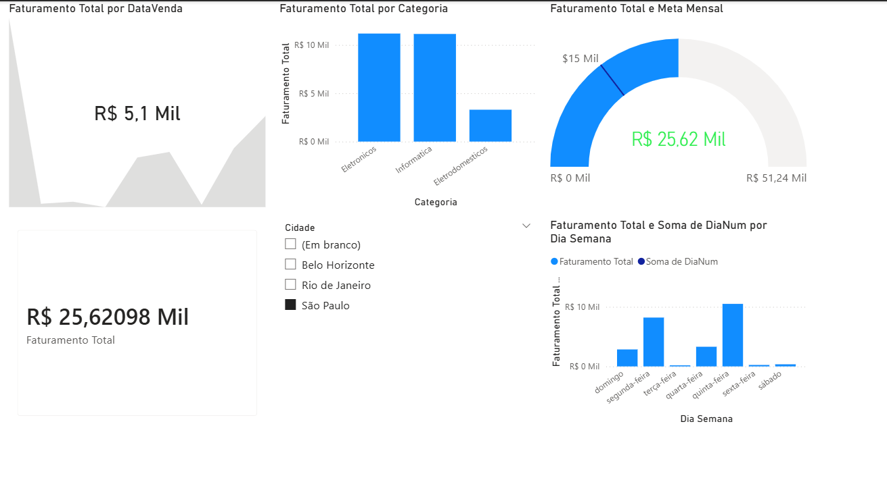

# 📊 Projeto End-to-End: Pipeline de Dados de Vendas

Este projeto demonstra um fluxo completo de Business Intelligence, integrando Banco de Dados, Programação e Visualização Executiva.

## 🚀 Tecnologias e Ferramentas
* **SQL Server**: Centralização e saneamento dos dados (Data Cleaning).
* **Python (pandas/pyodbc)**: Extração de dados e análise estatística.
* **Power BI**: Modelagem de dados (Star Schema) e Dashboards interativos.

## 🛠️ O que foi desenvolvido:
* **Saneamento via SQL**: Correção de inconsistências de nomes de cidades diretamente na fonte.
* **Integração com Python**: Script para validação de pipeline e integridade da conexão.
* **Modelagem Star Schema**: Implementação de tabela `dCalendario` em DAX para análises temporais.
* **Insights**: Monitoramento de metas e performance por categoria de produto.

---
*Projeto desenvolvido por Ricardo Neves www.linkedin.com/in/ricardo-alexandre-das-neves-393a533a2*
